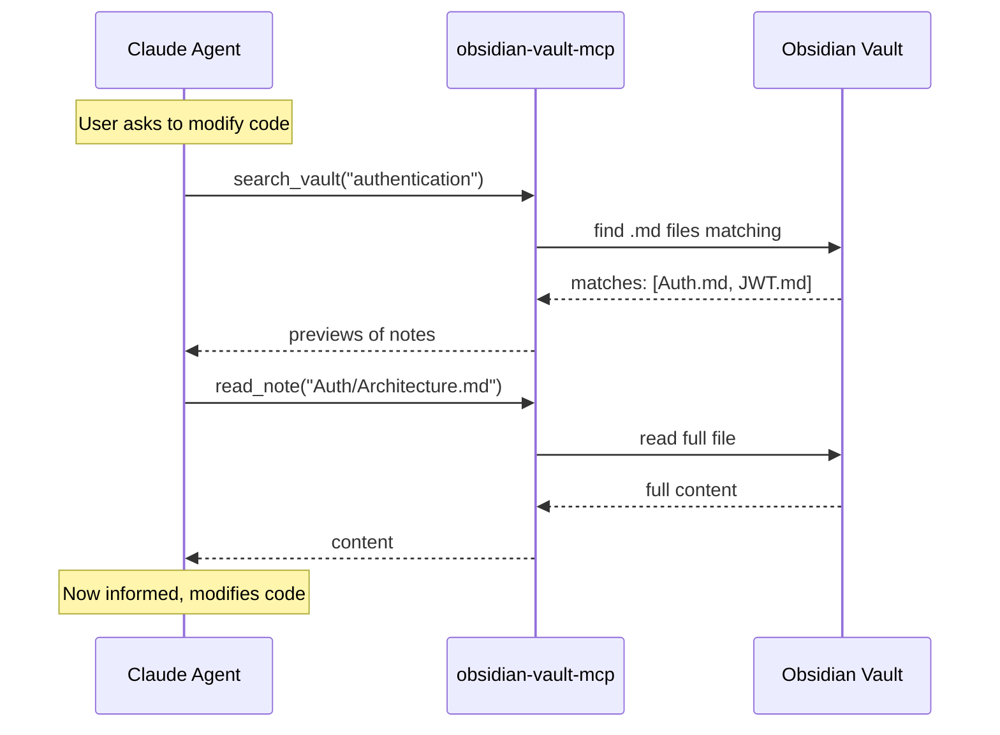

# Obsidian-Claude Bridge

> **Turn your Obsidian vault into Claude Code's long-term memory.**

[](https://python.org)
[](LICENSE)
[]()

---

## The Problem

You have **domain knowledge** living in Obsidian: business rules, architecture decisions, API contracts, research notes. But Claude Code starts every session **blind** to all of it.

```
┌─────────────────┐         ┌─────────────────┐
│  Your Brain     │         │  Claude Code    │
│  (Obsidian)     │   ???   │  (LLM Agent)    │
│                 │ ──────► │                 │
│  • Architecture │         │  ❌ No context  │
│  • Business     │         │  ❌ Repeats     │
│    rules        │         │     questions   │
│  • API docs     │         │  ❌ Wrong       │
│  • Research     │         │     assumptions │
└─────────────────┘         └─────────────────┘
```

Every session you end up:
- Copy-pasting notes into the chat.
- Re-explaining architecture you already documented.
- Watching the agent make wrong assumptions because it can't see your vault.

## The Solution

Obsidian-Claude Bridge installs a **thin MCP server** that lets Claude Code read your vault **as a filesystem** — no plugins, no cloud, no embedding costs.

```
┌─────────────────┐         ┌─────────────────┐         ┌─────────────────┐
│  Obsidian Vault │         │  MCP Server     │         │  Claude Code    │
│  (Markdown)     │◄────────│  (Python,       │◄────────│  (reads via     │
│                 │  fs     │   stdlib only)  │  stdio  │   tools)        │
│  • Notes        │         │                 │         │                 │
│  • Folders      │         │  search_vault   │         │  ✅ Domain      │
│  • Links        │         │  read_note      │         │     context     │
│                 │         │  list_notes     │         │  ✅ Accurate    │
│                 │         │                 │         │     decisions   │
└─────────────────┘         └─────────────────┘         └─────────────────┘
```

After installation, Claude Code **automatically searches your vault before modifying code** — as if it had read your docs beforehand.

## How It Works

> **No daemon. No background service. No manual startup.**
>
> Claude Code **spawns** `mcp_server.py` as a child process when your session starts. It reads your vault over the filesystem, responds to tool calls via JSON-RPC over `stdio`, and dies when you close Claude Code. You never run it manually.

### Agent Runtime Flow



## Features

| Feature | Detail |
|---|---|
| **Zero dependencies** | Python 3.8+ stdlib only. No `pip install`. No Obsidian plugins. |
| **Idempotent installer** | Run `install.sh` multiple times — never duplicates config or CLAUDE.md sections. |
| **Global or per-project** | Modify `~/.claude/CLAUDE.md` (all projects) or `./CLAUDE.md` (one repo). |
| **Safe uninstall** | `./uninstall.sh` removes only its own section; your existing CLAUDE.md is untouched. |
| **Backup & rollback** | Every mutation is backed up before changes. Failure triggers automatic rollback. |
| **Path traversal guard** | MCP server is locked to your vault directory; cannot escape. |
| **Token-aware** | Search returns max 10 results, 2000-char previews. No vault flooding. |

## Prerequisites

- **Python 3.8+** (`python3` or `python`)
- **Bash** (Git Bash, WSL, macOS, or Linux)
- **Claude Code** or **Open Code**
- An **Obsidian vault** (any folder containing `.md` files)

## Quick Start

```bash
# 1. Clone
git clone https://github.com/maitzeth/obsidian-claude-bridge.git
cd obsidian-claude-bridge

# 2. Install (interactive)
./install.sh

# 3. Or install non-interactively
./install.sh --vault ~/Documents/ObsidianVault --global --yes
```

### What the installer asks

1. **Vault path** — where your Obsidian notes live.
2. **Which CLAUDE.md** — global (`~/.claude/CLAUDE.md`) or project (`./CLAUDE.md`).
3. **Confirm** — shows what will change, asks `y/N`.

### After installation

Restart Claude Code or run `/mcp` to refresh tools. From then on, the agent will search your vault before writing code.

## MCP Tools

Once installed, Claude Code gains three tools:

### `search_vault`
Search notes by keyword in filename or content.

```json
{
  "query": "authentication",
  "max_results": 10
}
```

### `read_note`
Read the full content of a single note.

```json
{
  "path": "Architecture/Auth.md"
}
```

### `list_notes`
Browse the vault structure.

```json
{
  "directory": "Domain"
}
```

## Uninstallation

### Remove only CLAUDE.md instructions
```bash
./uninstall.sh
```

### Remove everything (MCP config + server + instructions)
```bash
./uninstall.sh --all
```

### Target a specific CLAUDE.md
```bash
./uninstall.sh --claude-md ./CLAUDE.md --all
```

## Project Structure

```
obsidian-claude-bridge/
├── install.sh          # Interactive installer (bash)
├── uninstall.sh        # Clean uninstaller (bash)
├── mcp_server.py       # MCP server (Python 3 stdlib)
├── README.md           # This file
└── openspec/           # SDD design artifacts
    ├── explore.md
    ├── proposal.md
    ├── spec.md
    ├── design.md
    ├── tasks.md
    ├── verify-report.md
    ├── sync-report.md
    └── archive-report.md
```

## Why This Approach?

| Alternative | Why We Didn't Use It |
|---|---|
| Obsidian REST API plugin | Requires plugin installation + Obsidian running. Filesystem is simpler and always available. |
| Sync to `DOMAIN_CONTEXT.md` | Static snapshot goes stale. Direct filesystem access is always up-to-date. |
| Semantic RAG / embeddings | Adds complexity and dependencies. Keyword search is "good enough" for most vaults and costs zero tokens to index. |
| Cloud-based memory | Your notes stay on your machine. No API keys, no subscription, no data leaves your laptop. |

## What This Solves That Engram (and Others) Don't

| Service | What it does | What it **doesn't** do | What this bridge covers |
|---|---|---|---|
| **Engram** | Memoria operativa de agente: guarda observaciones, bugs, decisiones entre sesiones. | No lee tu vault de Obsidian. No conoce tu documentación de dominio previa. | **Lee tu vault en tiempo real** como fuente de conocimiento estructurado antes de codear. |
| **OpenContext** | Documentación estática para que el agente entienda la arquitectura del proyecto. | Es manual, estático, requiere que copies info de Obsidian a un archivo del repo. | **Conecta directamente** con Obsidian sin duplicar contenido. Siempre actualizado. |
| **Obsidian MCP (genérico)** | Da acceso al agente a tu vault como un "disco externo". | No instruye al agente a *usarlo* antes de codear. El modelo puede ignorarlo. | **Inyecta instrucciones mandatorias** en `CLAUDE.md` para que el agente busque en el vault antes de tocar código. |
| **Context file sync** | Exporta notas a un `CONTEXT.md` en el repo. | Snapshot estático que se pudre. No escala a vaults grandes. | **Acceso dinámico bajo demanda**: busca, lista y lee solo lo relevante para la tarea actual. |

### El gap que cubre este bridge

Engram y servicios similares resuelven **memoria de ejecución** ("qué hicimos ayer, qué bug encontramos"). Pero **ninguno resuelve memoria de dominio documentada** que vive en Obsidian.

Este bridge cubre exactamente esa brecha:
- **Memoria de ejecución** → Engram (observaciones entre sesiones).
- **Memoria de dominio documentada** → **Este bridge** (vault de Obsidian como fuente de verdad).
- **Contexto de proyecto estático** → OpenContext / `CONTEXT.md` (documentación de arquitectura en el repo).

> **Uso recomendado**: Combiná este bridge con Engram. El bridge da contexto de dominio *antes* de codear; Engram guarda lo que aprendió *durante* la sesión.

## Windows Support

This installer requires Bash. On Windows, use one of:

- **Git Bash** (bundled with [Git for Windows](https://gitforwindows.org/))
- **WSL** (Windows Subsystem for Linux)
- **MSYS2**

A native PowerShell installer is not included yet (contributions welcome).

## Troubleshooting

### "Python 3.8+ is required"
Install Python from [python.org](https://python.org) or your package manager.

### "No .md files found in vault"
Make sure you passed the vault root folder (the one containing `.obsidian/` and your notes).

### Agent doesn't see the tools
Restart Claude Code or type `/mcp` to refresh the tool registry.

### Re-installing is safe
Run `./install.sh` again anytime — it updates the MCP server and replaces the CLAUDE.md section without duplication.

## License

MIT
