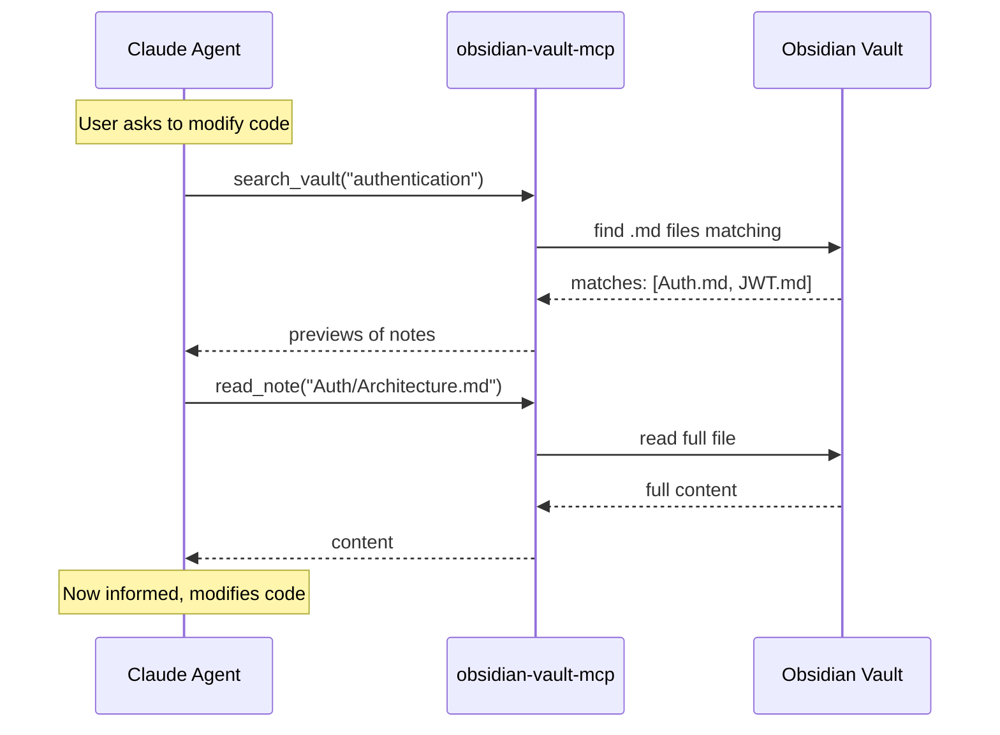

# Obsidian-Claude Bridge

> **Turn your Obsidian vault into Claude Code's long-term memory.**

[](https://python.org)
[](LICENSE)
[]()

---

## The Problem

You have **domain knowledge** living in Obsidian: business rules, architecture decisions, API contracts, research notes. But Claude Code starts every session **blind** to all of it.

```
┌─────────────────┐         ┌─────────────────┐
│  Your Brain     │         │  Claude Code    │
│  (Obsidian)     │   ???   │  (LLM Agent)    │
│                 │ ──────► │                 │
│  • Architecture │         │  ❌ No context  │
│  • Business     │         │  ❌ Repeats     │
│    rules        │         │     questions   │
│  • API docs     │         │  ❌ Wrong       │
│  • Research     │         │     assumptions │
└─────────────────┘         └─────────────────┘
```

Every session you end up:
- Copy-pasting notes into the chat.
- Re-explaining architecture you already documented.
- Watching the agent make wrong assumptions because it can't see your vault.

## The Solution

Obsidian-Claude Bridge installs a **thin MCP server** that lets Claude Code read your vault **as a filesystem** — no plugins, no cloud, no embedding costs.

```
┌─────────────────┐         ┌─────────────────┐         ┌─────────────────┐
│  Obsidian Vault │         │  MCP Server     │         │  Claude Code    │
│  (Markdown)     │◄────────│  (Python,       │◄────────│  (reads via     │
│                 │  fs     │   stdlib only)  │  stdio  │   tools)        │
│  • Notes        │         │                 │         │                 │
│  • Folders      │         │  search_vault   │         │  ✅ Domain      │
│  • Links        │         │  read_note      │         │     context     │
│                 │         │  list_notes     │         │  ✅ Accurate    │
│                 │         │                 │         │     decisions   │
└─────────────────┘         └─────────────────┘         └─────────────────┘
```

After installation, Claude Code **automatically searches your vault before modifying code** — as if it had read your docs beforehand.

The installer does three things:

1. Copies `mcp_server.py` to `~/.config/obsidian-claude-bridge/`.
2. Registers it as an MCP server with Claude Code (`~/.claude.json` for user scope, or `.mcp.json` for project scope).
3. Appends a marked instruction block to your `CLAUDE.md` telling the agent to consult the vault first.

## How It Works

> **No daemon. No background service. No manual startup.**
>
> Claude Code **spawns** `mcp_server.py` as a child process when your session starts. It reads your vault over the filesystem, responds to tool calls via JSON-RPC over `stdio`, and dies when you close Claude Code. You never run it manually.

### Agent Runtime Flow



## Features

| Feature | Detail |
|---|---|
| **Zero dependencies** | Python 3.8+ stdlib only. No `pip install`. No Obsidian plugins. |
| **Idempotent installer** | Run `install.sh` multiple times — never duplicates config or CLAUDE.md sections. |
| **Three scopes** | Global (every project), private per-project (`CLAUDE.local.md`, nothing committed), or team per-project (`CLAUDE.md` + `.mcp.json`). |
| **Safe uninstall** | `./uninstall.sh` removes only its own marked section; the rest of your CLAUDE.md is untouched. |
| **Backup & rollback** | Every file is backed up (`*.bak.<timestamp>`) before it is changed. A failed install restores what it touched and never rewrites malformed JSON. |
| **Path traversal guard** | Relative paths only, resolved through `realpath`; symlinks and `../` cannot escape the vault. |
| **Token-aware** | Search returns at most 10 results (cap 50) with 2000-char previews. Hidden folders like `.obsidian/` are skipped. |
| **Portable shell** | Works on stock macOS bash 3.2, Linux, WSL and Git Bash. Falls back to `python` or `py` when `python3` is missing. |

## Prerequisites

- **Python 3.8+** (`python3`, `python` or `py`)
- **Bash 3.2+** (Git Bash, WSL, macOS, or Linux)
- **Claude Code** (the installer writes Claude Code's MCP config; other MCP clients can reuse `mcp_server.py` manually)
- An **Obsidian vault** (any folder containing `.md` files)

## Quick Start

```bash
# 1. Clone
git clone https://github.com/maitzeth/obsidian-claude-bridge.git
cd obsidian-claude-bridge

# 2. Install (interactive)
./install.sh

# 3. Or install non-interactively (global CLAUDE.md + user-scope MCP)
./install.sh --vault ~/Documents/ObsidianVault --global --yes

# 4. Or for one project, private to you (nothing to commit)
./install.sh --vault ~/Documents/ObsidianVault --project ~/code/my-app --yes

# 5. Or for one project, shared with your team (commit CLAUDE.md and .mcp.json)
./install.sh --vault ~/Documents/ObsidianVault --project ~/code/my-app --scope project --yes
```

| Flag | Meaning |
|---|---|
| `-v, --vault PATH` | Obsidian vault directory |
| `-g, --global` | Every project: `~/.claude/CLAUDE.md` + user-scope MCP |
| `-p, --project DIR` | One project. Defaults to a private install |
| `-s, --scope user\|local\|project` | Override where the MCP server is registered (see table below) |
| `-c, --claude-md PATH` | Explicit CLAUDE.md path (advanced) |
| `-y, --yes` | Non-interactive |

### What the installer asks

Run `./install.sh` with no flags and answer three prompts:

1. **Vault path** — where your Obsidian notes live.
2. **Where to use it**:
   1. **Every project** — `~/.claude/CLAUDE.md` + `~/.claude.json`.
   2. **One project, only me** — asks for the project directory, writes `<project>/CLAUDE.local.md`, registers the server privately in `~/.claude.json` under that project, and adds `CLAUDE.local.md` to the project's `.gitignore`. Nothing to commit.
   3. **One project, whole team** — writes `<project>/CLAUDE.md` + `<project>/.mcp.json`. Commit both.
   4. **Custom CLAUDE.md path**.
3. **Confirm** — shows what will change, asks `y/N`.

Flags exist only for scripting; the interactive flow covers every option.

### After installation

Restart Claude Code. Run `/mcp` and confirm `obsidian-vault-mcp` shows as connected. For project scope, Claude Code asks you to approve the `.mcp.json` server the first time you open the folder.

### What gets written where

| Scope | MCP registration | Instructions file | Visible to |
|---|---|---|---|
| `user` (global) | `~/.claude.json` → `mcpServers` | `~/.claude/CLAUDE.md` | you, every project |
| `local` (private project) | `~/.claude.json` → `projects["<project>"].mcpServers` | `<project>/CLAUDE.local.md` (gitignored) | you, this project |
| `project` (team) | `<project>/.mcp.json` | `<project>/CLAUDE.md` | everyone who clones |

The server script itself always lives at `~/.config/obsidian-claude-bridge/mcp_server.py`. Instructions are written between `<!-- obsidian-bridge:v1 -->` markers so reinstalls replace rather than duplicate them. These are the same three scopes `claude mcp add --scope` uses.

The registration pins the absolute path of the Python interpreter that passed the version check, so the server keeps working even if your `PATH` changes.

## MCP Tools

Once installed, Claude Code gains three tools:

### `search_vault`
Case-insensitive keyword search. Filename matches rank first, then content matches (first 200k characters of each note are scanned). Hidden folders and non-`.md` files are ignored.

```json
{
  "query": "authentication",
  "max_results": 10
}
```

### `read_note`
Read the full content of a single note. Paths are relative to the vault root; absolute paths and traversal outside the vault are rejected.

```json
{
  "path": "Architecture/Auth.md"
}
```

### `list_notes`
Browse the vault structure.

```json
{
  "directory": "Domain"
}
```

## Uninstallation

### Remove only CLAUDE.md instructions
```bash
./uninstall.sh
```

### Remove everything (MCP registration + server + instructions)
```bash
./uninstall.sh --all
```

Every modified file is backed up first (`*.bak.<timestamp>`). A file that contained only the bridge section is deleted rather than left empty.

### Remove a per-project install (private or team)
```bash
./uninstall.sh --project ~/code/my-app --all
```

Cleans `CLAUDE.md` and `CLAUDE.local.md` in that directory, and removes only that project's registration (local scope in `~/.claude.json`, or `.mcp.json`). A global install is left untouched, and vice versa. The server script is deleted only when no registration references it anymore.

## Project Structure

```
obsidian-claude-bridge/
├── install.sh          # Interactive installer (bash)
├── uninstall.sh        # Clean uninstaller (bash)
├── mcp_server.py       # MCP server (Python 3 stdlib)
├── tests/
│   └── test_mcp_server.py  # Protocol + tool tests (unittest, no deps)
├── README.md           # This file
├── LICENSE             # MIT
└── openspec/           # SDD design artifacts
    ├── explore.md
    ├── proposal.md
    ├── spec.md
    ├── design.md
    ├── tasks.md
    ├── verify-report.md
    ├── sync-report.md
    └── archive-report.md
```

## Why This Approach?

| Alternative | Why We Didn't Use It |
|---|---|
| Obsidian REST API plugin | Requires plugin installation + Obsidian running. Filesystem is simpler and always available. |
| Sync to `DOMAIN_CONTEXT.md` | Static snapshot goes stale. Direct filesystem access is always up-to-date. |
| Semantic RAG / embeddings | Adds complexity and dependencies. Keyword search is "good enough" for most vaults and costs zero tokens to index. |
| Cloud-based memory | Your notes stay on your machine. No API keys, no subscription, no data leaves your laptop. |

## What This Solves That Engram (and Others) Don't

| Service | What it does | What it **doesn't** do | What this bridge covers |
|---|---|---|---|
| **Engram** | Operational agent memory: saves observations, bugs, decisions across sessions. | Does not read your Obsidian vault. Does not know your pre-existing domain documentation. | **Reads your vault in real time** as a structured knowledge source before coding. |
| **OpenContext** | Static documentation so the agent understands project architecture. | Manual, static, requires copying info from Obsidian into a repo file. | **Connects directly** to Obsidian without duplicating content. Always up-to-date. |
| **Obsidian MCP (generic)** | Gives the agent access to your vault like an "external drive". | Does not instruct the agent to *use* it before coding. The model may ignore it. | **Injects mandatory instructions** into `CLAUDE.md` so the agent searches the vault before touching code. |
| **Context file sync** | Exports notes to a `CONTEXT.md` in the repo. | Static snapshot that rots. Does not scale to large vaults. | **Dynamic on-demand access**: searches, lists, and reads only what is relevant to the current task. |

### The gap this bridge fills

Engram and similar services solve **execution memory** ("what did we do yesterday, what bug did we find"). But **none solve documented domain memory** that lives in Obsidian.

This bridge covers exactly that gap:
- **Execution memory** → Engram (observations across sessions).
- **Documented domain memory** → **This bridge** (Obsidian vault as source of truth).
- **Static project context** → OpenContext / `CONTEXT.md` (architecture docs in the repo).

> **Recommended usage**: Combine this bridge with Engram. The bridge provides domain context *before* coding; Engram saves what the agent learned *during* the session.

## Windows Support

This installer requires Bash. On Windows, use one of:

- **Git Bash** (bundled with [Git for Windows](https://gitforwindows.org/))
- **WSL** (Windows Subsystem for Linux)
- **MSYS2**

A native PowerShell installer is not included yet (contributions welcome).

## Troubleshooting

### "Python 3.8+ is required"
Install Python from [python.org](https://python.org) or your package manager.

### "No .md files found in vault"
Make sure you passed the vault root folder (the one containing `.obsidian/` and your notes).

### Agent doesn't see the tools
1. Restart Claude Code and run `/mcp`.
2. Check the registration: `claude mcp list` should include `obsidian-vault-mcp`.
3. Project scope: make sure you opened Claude Code inside the folder containing `.mcp.json` and approved the server.
4. Test the server by hand:
   ```bash
   printf '%s\n' '{"jsonrpc":"2.0","id":1,"method":"tools/list"}' | python3 ~/.config/obsidian-claude-bridge/mcp_server.py --vault ~/Documents/ObsidianVault
   ```

### Installer warns about a virtualenv
The registered interpreter is the one active when you ran `install.sh`. If that was a venv you later delete, re-run `./install.sh` from a shell with your system Python.

### "Refusing to overwrite malformed JSON"
`~/.claude.json` or `.mcp.json` is not valid JSON. The installer never rewrites a broken config; fix the file (or restore the latest `*.bak.*`) and re-run.

### Re-installing is safe
Run `./install.sh` again anytime — it updates the MCP server and replaces the CLAUDE.md section without duplication.

## Development

```bash
python3 -m unittest discover tests
```

The test suite drives the server through its stdio JSON-RPC loop: `initialize` handshake, notifications, error codes, ranking, traversal guards.

## Changelog

### 1.1.0
- **Fixed:** MCP server now implements the `initialize` handshake, `ping`, and ignores notifications. The previous version answered `Method not found` to `initialize`, so Claude Code could never connect.
- **Fixed:** MCP registration moved from `~/.claude/settings.json` (not read by Claude Code for servers) to `~/.claude.json` / `.mcp.json`.
- **Fixed:** `install.sh` crashed with `NameError: os` while editing CLAUDE.md; `${var,,}` and `$(cat <<EOF)` constructs broke on macOS bash 3.2; scripts lacked the executable bit in git.
- **Fixed:** Rollback could delete a pre-existing CLAUDE.md when the install failed before backing it up. Malformed JSON configs are now refused instead of overwritten.
- **Fixed:** Path guard used a string prefix check (`/vault` matched `/vault2`); now uses `realpath` + `commonpath`.
- **Added:** three install scopes (`user`, `local`, `project`) with a matching interactive menu and `--project` flag; private installs use `CLAUDE.local.md`. Uninstall backups, `python`/`py` fallback, unit tests, MIT license file.

## License

MIT
